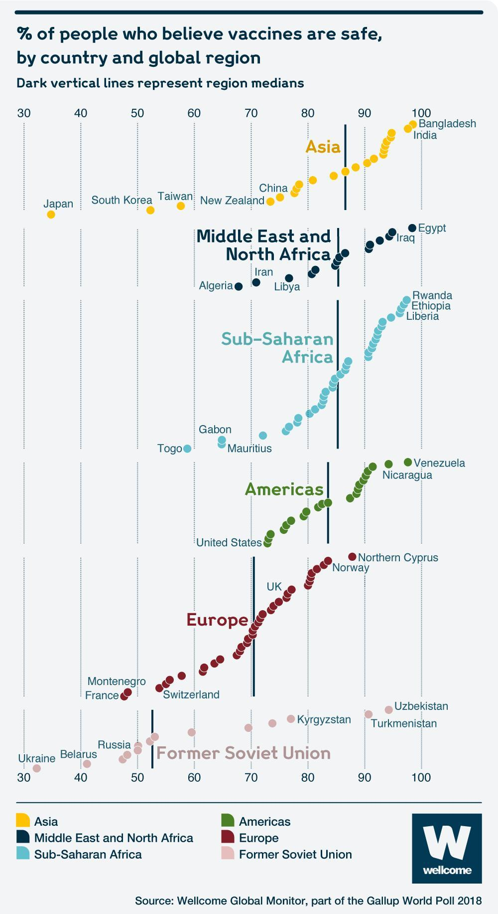

# Instructions

**Create a Quarto file for ALL Lab 2 (no separate files for Parts 1 and 2).**

- Make sure your final file is carefully formatted, so that each analysis is
clear and concise.
- Be sure your knitted `.html` file shows **all** your source code, including
any function definitions. 

# Part One: Identifying Bad Visualizations

If you happen to be bored and looking for a sensible chuckle, you should check
out these [Bad Visualisations](https://badvisualisations.tumblr.com/). Looking through these is also a good exercise in cataloging what makes a visualization
good or bad. 

## Dissecting a Bad Visualization

Below is an example of a less-than-ideal visualization from the collection
linked above. It comes to us from data provided for the [Wellcome Global Monitor 2018 report](https://wellcome.ac.uk/reports/wellcome-global-monitor/2018) by the 
Gallup World Poll:



1. While there are certainly issues with this image, do your best to tell the
story of this graph in words. That is, what is this graph telling you? What do
you think the authors meant to convey with it?

This graphic might be trying to say that certain regions' populations have more trust in vaccines; additionally, the graph might be trying to convey that some regions have a lot more variability, and attempts to highlight countries with extreme belief/disbelief within each region.

2. List the variables that appear to be displayed in this visualization. 
*Hint: Variables refer to columns in the data.*

Country, region, vaccine efficacy belief (% population )

3. Now that you're versed in the grammar of graphics (e.g., `ggplot`), list the *aesthetics* used and which *variables* are mapped to each.

Coloured and stacked by region. % belief is x-axis.

4. What type of graph would you call this? Meaning, what `geom` would you use
to produce this plot?

`geom_point()`

5. Provide at least four problems or changes that would improve this graph. 
*Please format your changes as bullet points!*

* Drop the stacking
* Facet across region across x-axis
* Make it a dot plot or violin plot or such
* Ditch the legend or ditch the region titles on the plot

## Improving the Bad Visualization

The data for the Wellcome Global Monitor 2018 report can be downloaded at the following site: [https://wellcome.ac.uk/reports/wellcome-global-monitor/2018](https://wellcome.org/sites/default/files/wgm2018-dataset-crosstabs-all-countries.xlsx)

<!-- at the "Dataset and crosstabs for all countries" link on the right side of the page-->

There are two worksheets in the downloaded dataset file. You may need to read
them in separately, but you may also just use one if it suffices.

```{r}
#| label: read-in-wellcome-data
#| warning: false
library(tidyverse)

df <- readxl::read_xlsx(
  here::here(
    "wgm2018-dataset-crosstabs-all-countries.xlsx"
  ),
  sheet = 2
)
```

6. Improve the visualization above by either re-creating it with the issues you
identified fixed OR by creating a new visualization that you believe tells the
same story better.

```{r}
#| label: new-and-improved-visualization
#| warning: false
df <- "0=Not assigned, 1=Africa,2=Africa,3=Africa,4=Africa,5=Africa,6=Americas,7=Americas,8=Americas,9=Asia,10=Asia,11=Asia,12=Asia,13=Middle East,14=Former Soviet Union,15=Europe,16=Europe,17=Europe,18=Asia" |>
  str_split(",") |>
  unlist() |>
  str_trim() |>
  as_tibble() |>
  separate_wider_delim(value, "=", names = c("Regions_Report", "Region")) |>
  mutate(Regions_Report = as.numeric(Regions_Report)) |>
  right_join(df) |>
  select(-Regions_Report)

df <- "1=United States, 2=Egypt, 3=Morocco, 4=Lebanon, 5=Saudi Arabia, 6=Jordan, 8=Turkey, 9=Pakistan, 10=Indonesia, 11=Bangladesh, 12=United Kingdom, 13=France, 14=Germany, 15=Netherlands, 16=Belgium, 17=Spain, 18=Italy, 19=Poland, 20=Hungary, 21=Czech Republic, 22=Romania, 23=Sweden, 24=Greece, 25=Denmark, 26=Iran, 28=Singapore, 29=Japan, 30=China, 31=India, 32=Venezuela, 33=Brazil, 34=Mexico, 35=Nigeria, 36=Kenya, 37=Tanzania, 38=Israel, 39=Palestinian Territories, 40=Ghana, 41=Uganda, 42=Benin, 43=Madagascar, 44=Malawi, 45=South Africa, 46=Canada, 47=Australia, 48=Philippines, 49=Sri Lanka, 50=Vietnam, 51=Thailand, 52=Cambodia, 53=Laos, 54=Myanmar, 55=New Zealand, 57=Botswana, 60=Ethiopia, 61=Mali, 62=Mauritania, 63=Mozambique, 64=Niger, 65=Rwanda, 66=Senegal, 67=Zambia, 68=South Korea, 69=Taiwan, 70=Afghanistan, 71=Belarus, 72=Georgia, 73=Kazakhstan, 74=Kyrgyzstan, 75=Moldova, 76=Russia, 77=Ukraine, 78=Burkina Faso, 79=Cameroon, 80=Sierra Leone, 81=Zimbabwe, 82=Costa Rica, 83=Albania, 84=Algeria, 87=Argentina, 88=Armenia, 89=Austria, 90=Azerbaijan, 96=Bolivia, 97=Bosnia and Herzegovina, 99=Bulgaria, 100=Burundi, 103=Chad, 104=Chile, 105=Colombia, 106=Comoros, 108=Republic of Congo, 109=Croatia, 111=Cyprus, 114=Dominican Republic, 115=Ecuador, 116=El Salvador, 119=Estonia, 121=Finland, 122=Gabon, 124=Guatemala, 125=Guinea, 128=Haiti, 129=Honduras, 130=Iceland, 131=Iraq, 132=Ireland, 134=Ivory Coast, 137=Kuwait, 138=Latvia, 140=Liberia, 141=Libya, 143=Lithuania, 144=Luxembourg, 145=Macedonia, 146=Malaysia, 148=Malta, 150=Mauritius, 153=Mongolia, 154=Montenegro, 155=Namibia, 157=Nepal, 158=Nicaragua, 160=Norway, 163=Panama, 164=Paraguay, 165=Peru, 166=Portugal, 173=Serbia, 175=Slovakia, 176=Slovenia, 183=Eswatini, 184=Switzerland, 185=Tajikistan, 186=The Gambia, 187=Togo, 190=Tunisia, 191=Turkmenistan, 193=United Arab Emirates, 194=Uruguay, 195=Uzbekistan, 197=Yemen, 198=Kosovo, 202=Northern Cyprus" |>
  str_split(",") |>
  unlist() |>
  str_trim() |>
  as_tibble() |>
  separate_wider_delim(value, "=", names = c("WP5", "Country")) |>
  mutate(WP5 = as.numeric(WP5)) |>
  right_join(df) |>
  select(-WP5)
```

```{r}
#| warning: false
library(gghalves)
# Taken from https://github.com/teunbrand/ggplot_tricks?tab=readme-ov-file#lets-begin
my_fill <- aes(fill = after_scale(alpha(colour, 0.3)))
# A small nudge offset
offset <- 0.025

df |>
  drop_na(Q25) |>
  mutate(
    vaccine = Q25 < 3,
    across(c(Country, Region), fct)
  ) |>
  filter(Region != "Not assigned") |>
  group_by(Country, Region) |>
  summarize(percent = mean(vaccine)) |>
  ggplot(
    aes(
      x = fct_reorder(Region, percent),
      y = percent,
      colour = Region,
      !!!my_fill
    )
  ) +
  geom_half_violin(side = "l", trim = FALSE, scale = "width") +
  geom_half_boxplot(
    side = "l",
    coef = 0,
    width = 0.4,
    outliers = FALSE,
    alpha = 0.3
  ) +
  geom_half_dotplot(
    method = "histodot",
    stackdir = "up",
    dotsize = 1,
    binwidth = 0.01
  ) +
  scale_y_continuous(labels = scales::label_percent(), limits = c(0, 1)) +
  coord_flip() +
  labs(
    x = element_blank(),
    y = element_blank(),
    title = "Vaccine Belief by Region and Country"
  ) +
  theme_bw() +
  theme(legend.position = "none")
```

# Part Two: Broad Visualization Improvement

The full Wellcome Global Monitor 2018 report can be found here: [https://wellcome.ac.uk/sites/default/files/wellcome-global-monitor-2018.pdf](https://wellcome.ac.uk/sites/default/files/wellcome-global-monitor-2018.pdf). 
Surprisingly, the visualization above does not appear in the report despite the
citation in the bottom corner of the image!

## Second Data Visualization Improvement

**For this second plot, you must select a plot that uses maps so you can demonstrate your proficiency with the `leaflet` package!**

7. Select a data visualization in the report that you think could be improved. 
Be sure to cite both the page number and figure title. Do your best to tell the
story of this graph in words. That is, what is this graph telling you? What do
you think the authors meant to convey with it?

From page 27, Chart 2.3: Map of perceived knowledge about science by country. The graph seems to be trying to show which countries have the populations which think of themselves as the most educated--it is also probably more focused on region as opposed to individual countries.

8. List the variables that appear to be displayed in this visualization.

Country, knowledge level.

9. Now that you're versed in the grammar of graphics (ggplot), list the
aesthetics used and which variables are specified for each.

Knowledge level is mapped to colour of the countries.

10. What type of graph would you call this?

It is a choropleth map.

11. List all of the problems or things you would improve about this graph.  

I don't like the colours that much, and I think the scale should be the same across all maps to better reflect the absolute percentage. Having the actual values available would be nice as well.

12. Improve the visualization above by either re-creating it with the issues you identified fixed OR by creating a new visualization that you believe tells the same story better.

```{r}
#| message: false
#| warning: false
library(leaflet)
library(rnaturalearth)
library(sf)

science <- df |>
  drop_na(Q1) |>
  mutate(science = Q1 < 3, Country = fct(Country)) |>
  group_by(Country) |>
  summarize(percent = mean(science))

country_data <- ne_countries(scale = "medium", returnclass = "sf") |>
  mutate(
    admin = case_when(
      admin == "United States of America" ~ "United States",
      admin == "Czechia" ~ "Czech Republic",
      admin == "Palestine" ~ "Palestinian Territories",
      admin == "Republic of the Congo" ~ "Republic of Congo",
      admin == "Gambia" ~ "The Gambia",
      admin == "United Republic of Tanzania" ~ "Tanzania",
      admin == "North Macedonia" ~ "Macedonia",
      admin == "Republic of Serbia" ~ "Serbia",
      admin == "Republic of Serbia" ~ "Serbia",
      TRUE ~ admin
    )
  ) |>
  right_join(science, by = join_by(admin == Country)) |>
  drop_na(scalerank)
```

```{r}
#| label: second-improved-visualization
country_colours <- colorNumeric(
  palette = "Greens",
  domain = country_data$percent,
  na.color = "#bdbdbd"
)

country_labels <- glue::glue(
  "<strong>{country_data$admin}</strong><br/>Percentage: {paste0(round(country_data$percent * 100, 1), '%')}"
) |>
  lapply(htmltools::HTML)

country_data |>
  leaflet() |>
  addTiles(options = tileOptions(noWrap = TRUE)) |>
  addPolygons(
    fillColor = ~ country_colours(percent),
    weight = 1,
    opacity = 1,
    color = "white",
    dashArray = "3",
    fillOpacity = 0.7,
    label = country_labels,
    highlightOptions = highlightOptions(
      weight = 3,
      color = "#666",
      dashArray = "",
      fillOpacity = 0.9,
      bringToFront = TRUE
    ),
    group = "Countries"
  )
```

## Third Data Visualization Improvement

**For this third plot, you must use one of the other `ggplot2` extension packages mentioned this week (e.g., `gganimate`, `plotly`, `patchwork`, `cowplot`).**

13. Select a data visualization in the report that you think could be improved. 
Be sure to cite both the page number and figure title. Do your best to tell the
story of this graph in words. That is, what is this graph telling you? What do
you think the authors meant to convey with it?

On page 112, Chart 5.4 is a Scatterplot exploring people’s perceptions of vaccine safety and vaccine effectiveness. This figure shows a correlation between proportion of people who think vaccines aren't effective and proportion of people who think vaccines aren't safe.

14. List the variables that appear to be displayed in this visualization.

Country, % vaccine safe, % vaccine effective.

15. Now that you're versed in the grammar of graphics (ggplot), list the
aesthetics used and which variables are specified for each.

Countries are mapped to points, %safe goes to x, %effective goes to y.

16. What type of graph would you call this?

Scatterplot.

17. List all of the problems or things you would improve about this graph.  

I think an interactive plot would be more suitable as then one could hover over countries and see individual datums. Also, I'd probably colour by region because that seems like an interesting factor to layer atop of this.

18. Improve the visualization above by either re-creating it with the issues you identified fixed OR by creating a new visualization that you believe tells the same story better.

```{r}
#| label: third-improved-visualization
library(plotly)
p <- df |>
  drop_na(Q25, Q26) |>
  mutate(
    safe = Q25 %in% c(4, 5),
    effective = Q26 %in% c(4, 5),
    across(c(Country, Region), fct)
  ) |>
  group_by(Country, Region) |>
  summarize(safe = mean(safe), effective = mean(effective)) |>
  ggplot(aes(x = safe, y = effective, color = Region)) +
  geom_point() +
  scale_x_continuous(labels = scales::label_percent()) +
  scale_y_continuous(labels = scales::label_percent()) +
  theme_bw()
ggplotly(p)
```
